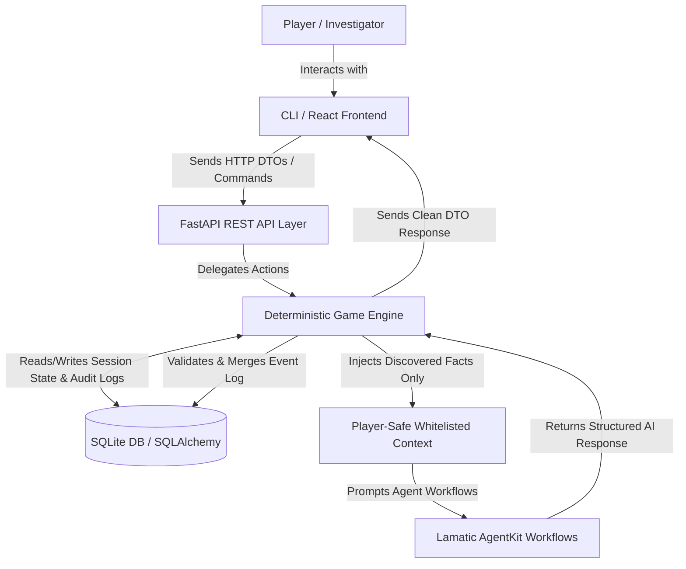

# DetectiveAI: Case Study & Project Summary

## Problem

Investigating complex cases in detective games usually requires players to manually correlate evidence, suspects, locations, timelines, and conflicting statements. Traditional game engines rely on rigid, hardcoded branching dialog trees that feel artificial and repetitive. 

Conversely, fully unconstrained LLM-driven roleplay games suffer from critical issues:
* **Hallucination & Inconsistency:** The LLM may invent non-existent suspects, misremember established facts, or change the culprit mid-investigation.
* **Lack of Rule Enforcement:** An LLM cannot reliably enforce complex game mechanics, action budgets, locked locations, or stage-progression constraints.
* **Solvability Loss:** The mystery loses structural integrity if the underlying ground truth is fluid or not authoritative.

DetectiveAI provides an AI-assisted investigation experience where players investigate cases through dynamic dialogue and analysis, while a deterministic game engine remains the absolute source of truth.

## Approach

DetectiveAI combines:
* **Deterministic Investigation Engine:** Enforces rule-based state transitions, player action validation (moving, inspecting, interviewing), and progress tracking.
* **FastAPI Backend:** Exposes versioned `/api/v1` RESTful endpoints to coordinate session lifecycle and engine logic.
* **React/TypeScript Frontend:** A modern single-page dashboard for interactive gameplay, notebook management, and clue tracking.
* **Typer CLI Interface:** A rich console presentation adapter for interactive terminal gameplay.
* **Lamatic AgentKit Workflows:** Orchestrates context-aware AI agents for natural language interactions and subjective grading:
  * **SuspectAgent:** Conducts realistic suspect interrogation dialogues.
  * **EvidenceAgent:** Generates forensic observations of found items.
  * **SolutionEvaluator:** Evaluates player case hypotheses using a multi-factor rubric.

AI agents operate only over explicitly whitelisted, player-discovered information, keeping the core mystery secure.

## Architecture

DetectiveAI employs a hybrid architecture separating authoritative state from LLM reasoning.



## Key Features

* **Suspect Interrogation:** Multi-turn natural language dialogue with suspects, constrained by their alibis and emotional states.
* **Forensic Evidence Analysis:** AI-assisted examination of discovered items to reveal hidden observations and follow-up clues.
* **Staged Investigation:** Narrative pacing through distinct investigation phases, locking or unlocking locations based on objectives.
* **Location & Movement Systems:** Action-point restricted movement and location exploration to find hidden clues.
* **Case Solution Evaluation:** A grading system combining deterministic culprit identification checks (30% weight) with subjective AI rubric scoring on the player's motive, timeline, and logic analysis (70% weight).

## Ground-Truth Protection

To prevent cheating, spoilers, or LLM hallucinations, the LLM is strictly isolated from core database entities and is never sent:
* `culprit_id` (the true killer)
* `is_culprit` (flags identifying suspects)
* `secret timeline` (unrevealed sequence of events)
* `solution_summary` (the official case solution explanation)
* `hidden evidence` (items not yet discovered by the player)
* `secret motive` (the actual underlying motive)

The agents evaluate user hypotheses and build alibis based solely on whitelisted public facts.

## Scenario

**The Midnight Archive:** A mystery scenario involving a high-profile security breach and theft of archival assets. Players explore the locations (e.g., Archive Vault, Security Room), inspect evidence (e.g., Modified USB Drive, Access Logs), and interrogate suspects (e.g., Sofia Bennett, Marcus Chen) to formulate a case hypothesis.

## Running Locally

### 1. Backend Setup
Initialize and activate a virtual environment (Python 3.12+):
```bash
python -m venv .venv
# Windows:
.venv\Scripts\Activate.ps1
# Linux/macOS:
source .venv/bin/activate
```
Install dependencies in editable mode:
```bash
pip install -e ".[dev]"
```
Start the FastAPI server:
```bash
python -m uvicorn app.main:app --reload
```

### 2. Frontend Setup
Navigate to the frontend folder, install packages, and start the development server:
```bash
cd frontend
npm install
npm run dev
```

### 3. CLI Play Mode
Explore scenarios and play directly in the terminal:
```bash
# List scenarios
python -m cli scenarios
# Start interactive terminal play
python -m cli play the_midnight_archive
```

## Lamatic Configuration

Configure connection keys in your local `.env` file to enable AI agents:
```env
LAMATIC_ENDPOINT=https://your-project.lamatic.ai/api/graphql
LAMATIC_PROJECT_ID=your-project-id
LAMATIC_API_KEY=your-api-key
LAMATIC_FLOW_ID=your-flow-id
```

## Testing

Comprehensive testing ensures reliable game engine transitions, scenario validations, and UI state integrity.

* **Backend (Pytest):** 138 unit and integration tests verifying deterministic state machine transitions, action validators, scenario loader cross-references, and offline fallbacks.
* **Frontend (Vitest & Happy DOM):** 12 component tests validating scenario selection screens, interactive dialogue panels, and case solution submissions.

## Tradeoffs and Assumptions

* **Stateless AI Workflows:** AI agents do not persist conversation state; the backend dynamically compiles historical dialogue logs from the database for each prompt turn. This simplifies LLM calls but increases database read overhead.
* **Deterministic Offline Fallback:** If Lamatic API services are unreachable or credentials are unset, the backend falls back to deterministic text responses, ensuring the game is fully playable without active internet connections.
* **Local Database Storage:** SQLite was selected for session storage to eliminate deployment overhead and keep the runtime lightweight, assuming single-player, local-first game sessions.

## Result

* Successfully deployed a hybrid AI-deterministic simulation engine combining FastAPI and React 19.
* Kept ground-truth data secure through a strict `InvestigationContext` boundary, showing zero context-leak incidents during gameplay.
* Delivered a polished, cross-platform experience across both terminal (CLI) and web dashboard interfaces.
* Maintained clean coding standards with Ruff formatting and automated test coverage pipelines.
